<h1>Programação Orientada a Objetos - Parte 02</h1>
<br />
<h2>Herança e Polimorfismo</h2>


Nos tópicos anteriores, estudamos os principais fundamentos da Programação Orientada a Objetos (POO), incluindo **Classes**, **Objetos**, **Métodos**, **Atributos** e **Encapsulamento**.

Agora, avançaremos no conteúdo abordando mais dois pilares essenciais da POO: **Herança** e **Polimorfismo**.

Antes de explorarmos esses conceitos em detalhes, é importante compreender o que são os **relacionamentos entre classes**, pois eles servem como base para entender como a herança e o polimorfismo se aplicam na prática.

<br />

<h2>1. Relacionamento entre Classes</h2>


Na Programação Orientada a Objetos, os **relacionamentos entre classes** definem como diferentes classes se conectam, interagem e colaboram dentro de um sistema. Esses relacionamentos são fundamentais para construir aplicações bem estruturadas, reutilizáveis e de fácil manutenção.

No exemplo abaixo, temos uma relação entre as classes `Veiculo` e `Carro`, onde **Carro é um tipo de Veículo**, como ilustrado no diagrama:

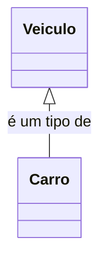

No próximo exemplo, temos as classes `Carro`, `Motor` e `Roda`. Um **Carro é composto por um Motor e por Rodas**, ou seja, **essas partes não existem independentemente do Carro**, como ilustrado no diagrama:

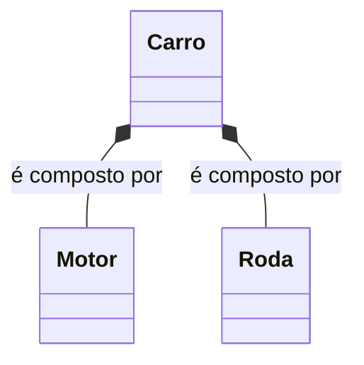

<br />

<h3>1.1. Por que os Relacionamentos são Importantes?</h3>


Ao projetarmos um sistema orientado a objetos, **compreender os tipos de relacionamentos entre classes é essencial** para garantir um código mais organizado, reutilizável e de fácil manutenção. Veja algumas razões:

- **Reutilização de código:** Se várias classes compartilham comportamentos ou atributos em comum, podemos centralizá-los em uma **superclasse** e utilizar o mecanismo de **herança** para evitar duplicação de código.
- **Divisão do trabalho em equipe:** Em casos onde as classes **não possuem dependências diretas**, é possível distribuí-las entre diferentes desenvolvedores, favorecendo o desenvolvimento simultâneo sem bloqueios.
- **Melhor modelagem do domínio:** Os relacionamentos nos ajudam a representar de forma mais fiel o mundo real dentro do código, facilitando a comunicação entre os objetos e a manutenção do sistema.

<br />

<h3>1.2. Tipos de relacionamento entre classes</h3>


Existem três tipos de relacionamentos mais comuns entre classes em Java:

- **Herança ("Is-A")** – representa o relacionamento “é um”, onde uma classe herda propriedades e comportamentos de outra;
- **Dependência ("Use-A")** – indica que uma classe utiliza ou depende de outra para realizar alguma função;
- **Associação ("Has-A")** – representa o relacionamento “tem um”, onde uma classe possui uma referência para outra.

Existem ainda dois tipos específicos de relacionamentos por associação:

- **Agregação** – uma relação mais fraca, onde os objetos envolvidos podem existir independentemente;
- **Composição** – uma relação forte, em que a existência dos objetos depende uns dos outros.

Confira o resumo visual dos tipos de relacionamento no organograma abaixo:

<div align="center"></div>

<br />

<h4>1.2.1. Relação de Herança</h4>


A **herança** estabelece um relacionamento entre uma classe mais genérica e abstrata, chamada **superclasse**, e uma classe mais especializada, conhecida como **subclasse**.

Em outras palavras, a herança define uma relação onde uma classe **"estende"** outra, caracterizando um vínculo do tipo **É-Um** (*Is-A*).

No contexto de e-commerce, por exemplo, podemos ter a superclasse `Produto` e subclasses como `Eletronico` e `Vestuario`, onde cada subclasse herda atributos e comportamentos comuns da superclasse `Produto` e adiciona suas especificidades.

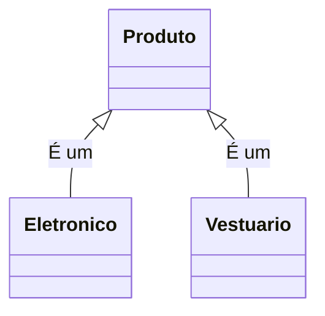

<br />

<h4>1.2.2. Relação de Dependência</h4>


A **dependência direta** (ou simplesmente *dependência*) em programação orientada a objetos ocorre quando uma classe utiliza outra temporariamente, geralmente por meio de parâmetros de métodos, criação de objetos locais ou chamadas diretas, **sem manter uma referência permanente (atributo)**.

### Características da dependência direta:

- A dependência ocorre quando **um método de uma classe utiliza temporariamente um objeto de outra classe para realizar uma tarefa específica**.
- Esse uso é **transitório**, ou seja, o objeto não é armazenado como atributo da classe, sendo usado apenas no escopo do método.
- Indica que uma classe **depende da existência da outra para executar uma ação**, mas não mantém um relacionamento fixo ou duradouro.
- Esse é o relacionamento **mais fraco e temporário** entre classes, diferente da associação, agregação ou composição.

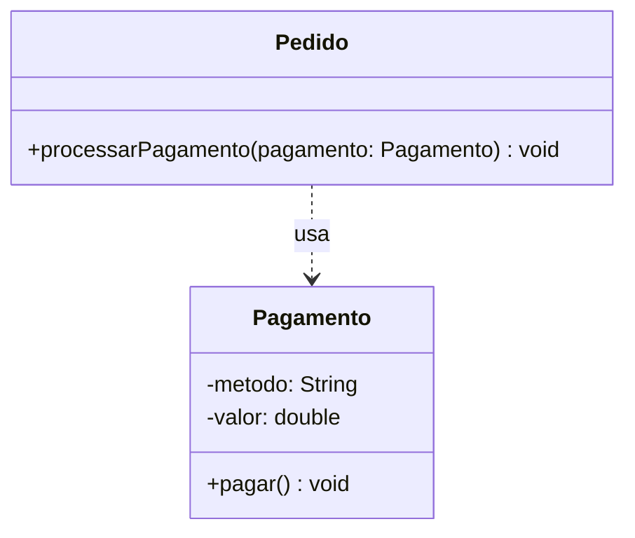

No diagrama acima, a classe `Pedido` **usa** a classe `Pagamento` apenas dentro do método `processarPagamento`, sem manter uma referência permanente (não há atributo `Pagamento` na classe `Pedido`).

<br />

<h4>1.2.3. Relacionamento por Associação</h4>


A **associação** é um dos principais tipos de relacionamento entre classes em programação orientada a objetos. Representa o vínculo onde uma classe utiliza ou conhece outra, sendo popularmente chamada de relação "**Tem-um**" (*Has-A*).

Quando uma classe possui um atributo que é uma instância de outra classe, dizemos que existe uma **associação** entre elas. Esse vínculo pode ser unidirecional (uma classe conhece a outra) ou bidirecional (ambas conhecem uma à outra).

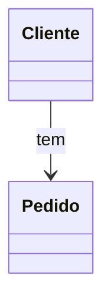

No diagrama acima, temos a classe `Cliente` associada à classe `Pedido`. Isso significa que:

- Um **Cliente** pode estar relacionado a **vários Pedidos**.
- Cada **Pedido** está associado a um **único Cliente**.

Essa relação é típica em sistemas de e-commerce ou gestão de vendas, onde **um cliente pode realizar múltiplas compras ao longo do tempo**, e cada pedido precisa estar vinculado a quem o realizou.

<br />

### Cardinalidade na Associação

A **cardinalidade** define quantos objetos de uma classe podem estar relacionados com objetos de outra classe. Essa informação é essencial para entender a natureza do vínculo entre os objetos.

As principais cardinalidades são:

- **Um para Um (1:1):** Um objeto de uma classe está associado a no máximo um objeto da outra.
- **Um para Muitos (1:N) / Muitos para Um (N:1):** Um objeto está relacionado a vários objetos da outra classe, ou vice-versa.
- **Muitos para Muitos (N:N):** Vários objetos de uma classe se relacionam com vários objetos da outra.

**Exemplo prático:**

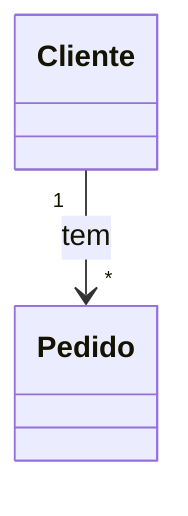

- Um **Cliente** pode **realizar vários Pedidos** (1:N).
- Cada **Pedido** pertence a **um único Cliente** (N:1).

Os conceitos de **relacionamento por associação** e **cardinalidade** são fundamentais também no **mapeamento de classes para tabelas em bancos de dados relacionais**, que estudaremos no Bloco 02 - Desenvolvimento Backend. 

Ao projetar um sistema orientado a objetos que se conecta a um banco de dados relacional (como MySQL, SQL Server, PostgreSQL ou Oracle), esses relacionamentos ajudam a definir **chaves primárias e estrangeiras** (*primary keys e foreign keys*) e **restrições de integridade** entre as tabelas.

<br />

<h4>1.2.4 - Relacionamento de Associação - Agregação</h4>


A **agregação** é um tipo especial de associação que representa uma relação do tipo "todo-parte", onde as partes podem existir de forma independente do todo. É conhecida como uma **associação fraca**, pois o ciclo de vida dos objetos não está vinculado.

No diagrama UML, a agregação é representada por um **losango branco** na extremidade do objeto "todo".

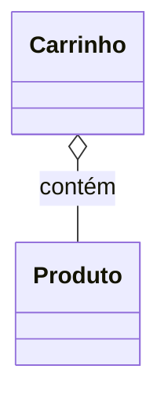

No exemplo acima:

- Um objeto `Carrinho` **contém** vários objetos `Produto`.
- Mesmo que o `Carrinho` seja excluído, os `Produtos` continuam existindo (por exemplo, ainda podem estar disponíveis no estoque).

**Características da agregação:**

- O objeto **parte** (`Produto`) **não depende** do objeto **todo** (`Carrinho`) para existir.
- O objeto **todo** **mantém a referência** às partes.
- A destruição do todo **não impacta** as partes.

<br />

<h4>1.2.5 - Relacionamento de Associação - Composição</h4>


A **composição** é uma forma mais forte de associação, em que os objetos "parte" **dependem totalmente** do objeto "todo". É usada quando o ciclo de vida das partes está diretamente ligado ao ciclo de vida do todo.

Na notação UML, é representada por um **losango preto** na extremidade do objeto agregador.

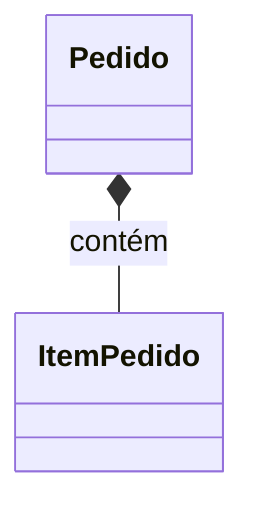

No exemplo acima:

- Um objeto `Pedido` **é composto** por vários `Itens do Pedido`.
- Os `ItemPedido` **não fazem sentido existir** sem estarem ligados a um `Pedido` específico.
- Se o `Pedido` for excluído, todos os `Itens do Pedido` também devem ser destruídos.

Embora o Java não tenha uma palavra-chave específica para indicar composição, essa relação pode ser representada pela forma como as classes são estruturadas e instanciadas.

**Características da Composição:**

- O objeto parte (`ItemPedido`) **não existe sem** o objeto todo (`Pedido`).
- O ciclo de vida das partes é **controlado** pelo todo.
- Ao destruir o objeto todo, **todas as partes também são destruídas**.

<br />

> [!IMPORTANT]
>
> Dentro do contexto de um e-commerce, embora `Carrinho` e `Pedido` manipulem produtos, é fundamental entender que **representam conceitos distintos**.
>
> - O **Carrinho** é utilizado durante o processo de compra, enquanto o cliente ainda está escolhendo os produtos. Ele pode ser modificado a qualquer momento antes da finalização.
> - O **Pedido**, por outro lado, **representa a compra finalizada**, com todos os dados confirmados e prontos para o processamento (como pagamento e entrega).
>
> Essa distinção também influencia no tipo de relacionamento: enquanto o carrinho possui produtos de forma independente (agregação), o pedido **compõe** os itens de forma definitiva e dependente (composição).

<br />

Compreender os diferentes tipos de associação (simples, agregação e composição) é essencial para modelar bem os relacionamentos entre objetos na programação orientada a objetos. Saber identificar se os objetos devem ou não depender uns dos outros ajuda a construir sistemas mais **flexíveis**, **coerentes** e **fáceis de manter**.

Esses conceitos estão diretamente alinhados às diretrizes de modelagem orientada a objetos utilizadas na UML (Unified Modeling Language) e amplamente aplicados em linguagens como Java, C#, Python, entre outras.

<br />

<h3>1.3. Como decidir que tipo de relacionamento precisamos?</h3>


Na modelagem orientada a objetos, é essencial saber **qual tipo de relacionamento** utilizar entre as classes. Os dois mais comuns e importantes no dia a dia do desenvolvimento são:

- O relacionamento **“É-um”** (Herança ou Generalização);
- O relacionamento **“Tem-um”** (Associação).

A melhor forma de decidir qual aplicar é **observar a forma como descrevemos o problema no mundo real**, com foco na semântica da frase.

<br />

### 1. Herança: Quando usar o relacionamento “É-um”


Se o seu problema puder ser descrito com a frase:

> **“O objeto A é um tipo do objeto B”**,

então estamos diante de um caso de **herança**, também conhecido como **relação de generalização/especialização**.

**Exemplo:**

> “Um **Cachorro** é um **Pet**.”

Essa frase faz sentido lógico e estrutural, indicando que **Cachorro é uma especialização de Pet**, ou seja, **herda atributos e comportamentos** da classe genérica `Pet`.

Neste caso, usamos herança para criar uma **superclasse** chamada `Pet` e uma **subclasse** chamada `Cachorro`, que estende as características da superclasse.

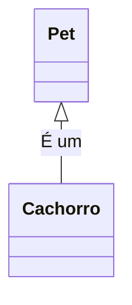

<br />

### 2. Associação: Quando usar o relacionamento “Tem-um”


Agora, se o seu problema puder ser descrito com a frase:

> **“O objeto A tem um objeto B”**,

então devemos utilizar o relacionamento de **associação**.

**Exemplo:**

> “Um **Pet** tem uma **Raça**.”

Essa frase indica que existe uma **dependência ou vínculo entre os objetos**, mas sem herança. Ou seja, `Pet` mantém uma referência para um objeto do tipo `Raca`, mas eles são classes distintas e complementares.

Não faria sentido dizer:

> “Um Pet é uma Raça” — isso seria semanticamente incorreto.

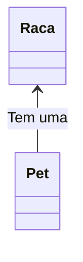

<br />

## 🆚 Tabela Comparativa: Herança vs Dependência vs Associação

| Tipo            | Representação | Significado | Exemplo prático                    |
| --------------- | ------------- | ----------- | ---------------------------------- |
| **Herança**     | "Is-A"        | É um        | Um `Carro` **é um** `Veículo`      |
| **Dependência** | "Use-A"       | Usa um      | Um `Pedido` **usa** um `Pagamento` |
| **Associação**  | "Has-A"       | Tem um      | Um `Carro` **tem um** `Motor`      |

<br />

> [!IMPORTANT]
>
> Neste primeiro momento, nosso foco será na <strong>relação de Herança</strong>, pois ela é fundamental para compreender a especialização de classes e o conceito de reutilização de código

<br />

<h2>2. Herança</h2>


Um dos pilares mais importantes da **programação orientada a objetos** é o conceito de **herança**.

A **herança** é um mecanismo que permite que uma classe reutilize atributos e comportamentos (métodos) de outra classe. Em outras palavras, uma classe pode **herdar** as características de uma **superclasse** (ou classe base), evitando duplicação de código e promovendo **reuso e organização**.

> 📘 Em Java, a herança é implementada com a palavra-chave `extends`.

<div align="center"></div>

- Analisando a imagem:
  
  - A **classe Transporte** define o atributo `capacidade`, comum a todos os tipos de transporte.
  - A **classe Terrestre** adiciona os atributos `número de rodas` e `velocidade` (em km/h).
  - A **classe Automovel**, herdeira de `Terrestre`, define `cor`, `número de portas`, `placa` e `marcha`.
  - Da mesma forma, temos as hierarquias:
    - `Aquático` → `Barco`
    - `Aéreo` → `Avião`
  
  Essas relações mostram que:
  
  - **Barco**, por herdar de `Aquático`, também herda tudo o que vem de `Transporte`.
  - **Automovel** herda de `Terrestre`, que por sua vez herda de `Transporte`.
  
  Portanto, herança é uma forma de **reutilização de código**: uma classe herdeira (**subclasse**) absorve os membros (atributos e métodos) da classe de origem (**superclasse**) e pode ainda adicionar novos comportamentos ou especializar os existentes.

Abaixo, vemos o Diagrama de Classes do exemplo acima:

**Exemplo 01 - Diagrama de Classes** 

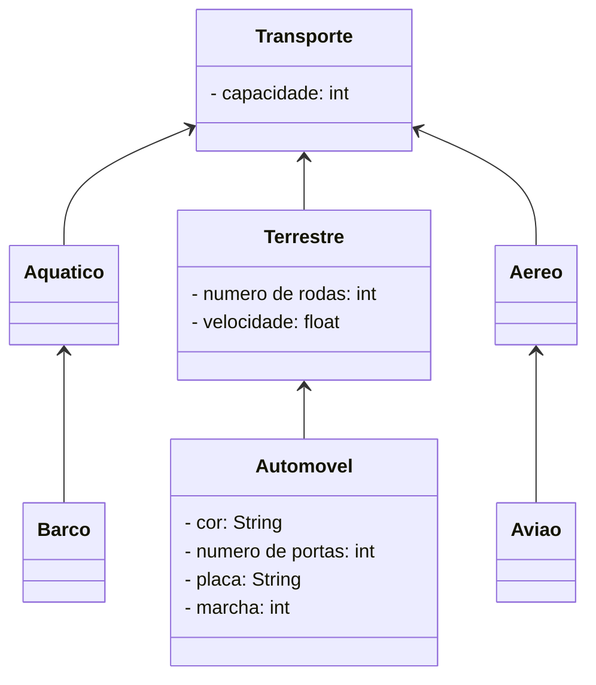

<br />

<h3>2.1. Tipos de Herança</h3>


Existem basicamente 2 tipos de herança:

- **Herança Simples:** Cada classe pode ter apenas uma superclasse. Na linguagem Java usa-se a palavra reservada **extends** para declarar que uma classe é herdeira de outra.

- **Herança Múltipla:** É a capacidade de uma classe possuir mais de uma superclasse e herdar os atributos e métodos de todas as superclasses. 

**Java não suporta herança múltipla de classes**, mas permite que uma classe implemente múltiplas interfaces, oferecendo uma forma de simular herança múltipla de comportamento (não de estado).

> ### Herança de Estado vs Herança de Comportamento
>
> **Herança de Estado** refere-se à reutilização dos **atributos** (variáveis de instância) de uma superclasse pela subclasse. Ou seja, a subclasse herda os dados que representam o estado do objeto, como propriedades, características ou informações.
>
> **Herança de Comportamento** refere-se à reutilização dos **métodos** (funções, ações) definidos na superclasse pela subclasse. A subclasse pode usar esses métodos diretamente ou sobrescrevê-los (polimorfismo) para alterar seu comportamento.

<br />

<h3>2.2. Herança em Java</h3>


**Sintaxe:**

```java
[modificadores] class NomeDaSubclasse extends NomeDaSuperClasse{
    // Corpo da Subclasse
}
```

Onde:

- **Modificadores**: Modificadores de Acesso e Non-Access

<br />

<h4>2.2.1. Modificadores de Acesso</h4>


As Classes possuem apenas 2 modificadores de acesso:

| **Modificador** | **Descrição**                                                |
| --------------- | ------------------------------------------------------------ |
| **padrão**      | Também chamado de *package-private*; uma classe com acesso padrão (sem modificador explícito) pode ser acessada por outras classes que estejam **no mesmo pacote**. |
| **public**      | Uma classe `public` pode ser acessada por qualquer outra classe, independentemente do pacote onde estiver. |

<br />

<h4>2.2.2. Modificadores Non-Access</h4>


As Classes possuem dois modificadores de Classes:

| **Modificador** | **Descrição**                                                |
| --------------- | ------------------------------------------------------------ |
| **abstract**    | Uma classe abstrata **não pode ser instanciada diretamente**. Ela serve como modelo para outras classes que a herdam e devem implementar seus métodos abstratos (se houver). |
| **final**       | Uma classe final **não pode ser herdada por outras classes**. É usada para impedir especializações e garantir comportamento final. |

***Observações importantes:***

- Uma classe **não pode ser** `abstract` **e** `final` **ao mesmo tempo**, pois são conceitos contraditórios.
- Classes abstratas servem como base para herança, mas **não podem ser instanciadas diretamente**.

<br />

<h4>2.2.3. A palavra reservada extends</h4>


A palavra reservada `extends` indica que uma nova classe está sendo criada como uma **subclasse** (classe derivada) de uma **superclasse** (classe base).

- A **superclasse** é a classe existente que será estendida.
- A **subclasse** é a nova classe que herda atributos e métodos da superclasse, podendo adicionar ou modificar comportamentos.

<br />

<div align="left"> <a href="https://www.w3schools.com/java/java_modifiers.asp" target="_blank"><b>Documentação: Modificadores de Classes</b></a></div>

<div align="left"> <a href="https://www.w3schools.com/java/ref_keyword_extends.asp" target="_blank"><b>Documentação: Palavra reservada extends</b></a></div>

<br />

<h3>2.3 O Método Construtor da Subclasse</h3>


O **método construtor** de uma subclasse geralmente utiliza o comando `super()` para chamar o **construtor da superclasse**. Essa chamada é fundamental para garantir que os atributos herdados da superclasse sejam inicializados corretamente.

- O uso de `super()` **deve ser a primeira instrução dentro do construtor da subclasse**.
- No `super()` devem ser passados os parâmetros necessários para inicializar os atributos da superclasse.
- Os atributos específicos da subclasse devem ser inicializados no próprio construtor da subclasse, após a chamada ao `super()`.

<br />

<h3>2.4 A palavra reservada super</h3>


Além do uso em construtores, a palavra reservada `super` também pode ser usada para **referenciar explicitamente membros (métodos ou atributos) da superclasse**.

- É comum utilizar `super` para **chamar métodos da superclasse que foram sobrescritos na subclasse**, evitando ambiguidades.
- A palavra reservada `this` refere-se ao objeto atual da classe, enquanto `super` refere-se ao objeto da superclasse correspondente.

<br />

<div align="left"> <a href="https://docs.oracle.com/javase/tutorial/java/IandI/super.html" target="_blank"><b>Documentação: Método super()</b></a></div>

<div align="left"> <a href="https://www.w3schools.com/java/ref_keyword_super.asp" target="_blank"><b>Documentação: Palavra reservada super</b></a></div>

<br />

## Exemplo 01 - Herança

**Classe Transporte**

```java
package exemplos_heranca;

public class Transporte {

	private int capacidade;

	public Transporte(int capacidade) {
		this.capacidade = capacidade;
	}

	public int getCapacidade() {
		return capacidade;
	}

	public void setCapacidade(int capacidade) {
		this.capacidade = capacidade;
	}
	
	public void visualizar() {
		
		System.out.println("\n\n************************************************************");
		System.out.println("Dados do Meio de Transporte:");
		System.out.println("****************************************************************");
		System.out.println("Capacidade (número de passageiros): " + this.capacidade);
		
	}
}
```

A **classe `Transporte`** (superclasse) foi implementada com apenas um atributo: `capacidade`, conforme representado no diagrama de classes apresentado anteriormente.

Além do atributo, a classe contém:

- Um **método construtor**, responsável por inicializar o valor do atributo `capacidade` no momento da criação do objeto;
- Os métodos **get** e **set**, utilizados para acessar e modificar o valor de `capacidade`;
- Um método chamado **`visualizar()`**, que exibe os dados do objeto na tela, facilitando a visualização e validação das informações armazenadas.

Essa estrutura básica permite que a classe `Transporte` sirva como base para outras subclasses, garantindo a reutilização do atributo comum e dos comportamentos compartilhados.

<br />

**Classe Terrestre**


```java
package exemplos_heranca;

public class Terrestre extends Transporte {

	private int numeroRodas;
	private float velocidade;

	public Terrestre(int capacidade, int numeroRodas, float velocidade) {
		super(capacidade);
		this.numeroRodas = numeroRodas;
		this.velocidade = velocidade;
	}

	public int getNumeroRodas() {
		return numeroRodas;
	}

	public void setNumeroRodas(int numeroRodas) {
		this.numeroRodas = numeroRodas;
	}

	public float getVelocidade() {
		return velocidade;
	}

	public void setVelocidade(float velocidade) {
		this.velocidade = velocidade;
	}

    @Override
	public void visualizar() {

		super.visualizar();
		System.out.println("Número de rodas: " + this.numeroRodas);
		System.out.println("Velocidade: " + this.velocidade);

	}
}
```

A **classe `Terrestre`** (subclasse) foi criada como uma especialização da classe `Transporte`, utilizando o recurso de **herança** por meio da palavra-chave `extends Transporte`, conforme representado no diagrama de classes acima.

Ela possui dois novos atributos:

- `numeroRodas`
- `velocidade`

Além dos atributos, foram implementados:

- O **método construtor**, que inicializa os atributos da classe, incluindo o atributo herdado `capacidade`;
- Os métodos **get** e **set** para `numeroRodas` e `velocidade`;
- O método **`visualizar()`**, responsável por exibir os dados do objeto na tela.

**Observações importantes:**

- O método construtor da classe `Terrestre` inclui o parâmetro `capacidade`, herdado da superclasse. Esse valor é repassado ao construtor da superclasse utilizando o comando **`super(capacidade)`**, que deve ser a primeira instrução do construtor;
- No método `visualizar()`, o comando **`super.visualizar()`** é utilizado para chamar o método da superclasse, garantindo que as informações da classe `Transporte` também sejam exibidas corretamente junto aos dados específicos da subclasse `Terrestre`.

<br />

**Classe Automovel**

```java
package exemplos_heranca;

public class Automovel extends Terrestre{

	private String cor;
	private int numeroPortas;
	private String placa;
	private int marcha;
	
	public Automovel(int capacidade, int numeroRodas, float velocidade, String cor, int numeroPortas, String placa, int marcha) {
		super(capacidade, numeroRodas, velocidade);
		this.cor = cor;
		this.numeroPortas = numeroPortas;
		this.placa = placa;
		this.marcha = marcha;
	}

	public String getCor() {
		return cor;
	}

	public void setCor(String cor) {
		this.cor = cor;
	}

	public int getNumeroPortas() {
		return numeroPortas;
	}

	public void setNumeroPortas(int numeroPortas) {
		this.numeroPortas = numeroPortas;
	}

	public String getPlaca() {
		return placa;
	}

	public void setPlaca(String placa) {
		this.placa = placa;
	}
	
	public int getMarcha() {
		return marcha;
	}

	public void setMarcha(int marcha) {
		this.marcha = marcha;
	}

    @Override
	public void visualizar() {

		super.visualizar();
		System.out.println("cor: " + this.cor);
		System.out.println("Número de portas: " + this.numeroPortas);
		System.out.println("Placa: " + this.placa);
		System.out.println("Marcha: " + this.marcha);
		
	}
}
```

A **Classe Automovel** (Subclasse) foi criada como herança da **Classe Terrestre** (`extends Terrestre`), contendo os atributos **cor**, **número de portas**, **placa** e **marcha**, conforme ilustrado no Diagrama de Classes acima. Além disso, foram implementados o **método construtor**, os **métodos de acesso (get e set)** para cada atributo e o **método `visualizar()`** para exibição dos dados do objeto.

Observe que:

- No **método construtor**, foram incluídos como parâmetros os atributos **capacidade** (herdado da Classe Transporte), **numeroRodas** e **velocidade** (herdados da Classe Terrestre), além dos atributos específicos da própria Classe Automovel.
- Dentro do corpo do construtor, foi utilizada a **chamada ao método `super(capacidade, numeroRodas, velocidade)`**, com o objetivo de inicializar corretamente os atributos herdados da Classe Terrestre e, indiretamente, da Classe Transporte.
- No **método `visualizar()`**, também foi utilizada a chamada `super.visualizar()` para reaproveitar a exibição dos atributos herdados, garantindo que os dados das Classes Transporte e Terrestre sejam listados antes dos dados específicos da Classe Automovel.

<br />

**Classe Exemplo01 (classe principal)**

```java
package exemplos_heranca;

public class Exemplo01 {

	public static void main(String[] args) {

		Automovel a1 = new Automovel(5, 4, 0.0f, "Verde", 4, "EBN-0301", 0);
		
		a1.visualizar();

	}
}
```

Na **classe `Exemplo01`**, foi instanciado um objeto da **classe `Automovel`**.

Devido à hierarquia de herança entre as classes, o construtor da classe `Automovel` exige **sete parâmetros**, correspondentes aos atributos herdados e aos próprios da subclasse:

- **capacidade** – herdado da **classe `Transporte`**
- **numeroRodas** e **velocidade** – herdados da **classe `Terrestre`**
- **cor**, **numeroPortas**, **placa** e **marcha** – definidos na **classe `Automovel`**

Essa estrutura demonstra a reutilização e o encadeamento de atributos promovidos pela herança, otimizando o reaproveitamento de código.

Abaixo, segue a saída gerada no console com a execução do método `visualizar()`:

**Resultado do Algoritmo:**

```
*********************************************************************
Dados do Meio de Transporte:
*********************************************************************
Capacidade (número de passageiros: 5
Número de rodas: 4
Velocidade: 0.0
cor: Verde
Número de portas: 4
Placa: EBN-0301
Marcha: 0
```

<br />

> [!TIP]
>
> **Dicas sobre Herança:**
>
> A herança é um dos pilares da Programação Orientada a Objetos (POO) e deve ser utilizada com atenção e planejamento. Aqui estão algumas boas práticas e orientações para aplicar corretamente esse recurso:
>
> 1. **Centralize o que é comum**: Sempre defina os **atributos e métodos comuns** a todas as subclasses na **superclasse**. Isso evita duplicidade de código e promove maior reaproveitamento e organização.
> 2. **Use herança quando houver uma relação "é um"**: A herança deve representar uma relação **"é um tipo de"**. Ou seja, um objeto da **subclasse** **é também um objeto da superclasse**.
>     <br>
>     *Exemplo:* Um `Automovel` **é um tipo de veículo** `Terrestre`, que por sua vez **é um tipo de** `Transporte`.
> 3. **Evite herança quando não for necessária**: Não utilize herança se **apenas alguns poucos métodos ou atributos** da superclasse forem úteis para a subclasse. Isso pode gerar acoplamento desnecessário. Nestes casos, **prefira a composição**.
> 4. **Utilize `super` de forma consciente**: Use a palavra-chave `super` para acessar o construtor ou métodos da superclasse. Isso é útil para **inicializar atributos herdados** ou **executar comportamentos comuns**, sem precisar reescrever código.
> 5. **Mantenha a hierarquia simples**: Evite cadeias longas de herança (4 ou mais níveis). Isso torna o código mais difícil de entender, manter e testar. Prefira **modelos mais planos e coesos**.
> 6. **Documente a hierarquia**: Ao criar uma estrutura de herança, é importante **manter um diagrama de classes** ou uma documentação clara para facilitar a leitura, manutenção e expansão do sistema.

<br />

<h2>3. Polimorfismo</h2>


O termo **polimorfismo** deriva do grego *polymorphos*, que significa “muitas formas”. Em programação orientada a objetos (POO), **polimorfismo é a capacidade que objetos de classes diferentes têm de responder à mesma mensagem (método) de maneiras distintas**.

Em outras palavras, o polimorfismo permite que **múltiplas classes tenham métodos com o mesmo nome**, mas com **comportamentos diferentes**, adequados ao contexto de cada classe. Isso possibilita maior flexibilidade, reutilização de código e extensibilidade no desenvolvimento de sistemas orientados a objetos.

**Exemplo ilustrativo**

Imagine que o dono de uma fábrica de brinquedos solicitou aos engenheiros que criassem **um único controle remoto para todos os brinquedos**. A única exigência é que **cada brinquedo responda ao comando de forma adequada à sua natureza**.

<div align="center"></div>

Quando o controle envia o comando `mover`, cada brinquedo interpreta esse comando de maneira diferente:

- Para o **avião**, mover significa **voar**;
- Para o **barco**, significa **navegar**;
- Para o **automóvel**, significa **correr**.

<div align="center"></div>

Observe que, embora a mensagem seja a mesma (`mover`), **cada objeto responde de maneira específica**, conforme sua implementação. Isso é o que caracteriza o polimorfismo.

<br />

<h3>3.1. Como funciona na prática?</h3>


Na prática, o polimorfismo ocorre da seguinte forma:

1. Ao enviar uma mensagem (chamada de método) para um **objeto de uma subclasse**, o interpretador verifica se a subclasse possui esse método com os **mesmos parâmetros** informados:
   - ✅ **Se sim**, o método da subclasse é executado.
   - ❌ **Se não**, o sistema procura o método na **superclasse**.
2. A **superclasse** entra em ação e executa o método correspondente, se disponível.
3. Esse comportamento permite que a mesma chamada de método produza **resultados diferentes**, dependendo do objeto que a recebe.

<br />

<h3>3.2. Tipos de Polimorfismo</h3>


O polimorfismo pode ser classificado em dois tipos principais:

<br />

<h4>3.2.1. Polimorfismo de Sobrecarga (Sobrecarga de Método)</h4>


**Sobrecarga de métodos** consiste em definir **vários métodos com o mesmo nome** dentro de uma mesma classe, mas com **assinaturas diferentes** (quantidade, tipo ou ordem dos parâmetros). Veja o exemplo a seguir:

<br />

## Exemplo 02: Polimorfismo de Sobrecarga

```java
public class Transporte {

	private int capacidade;

    /*Método Construtor com parâmetros*/
	public Transporte(int capacidade) {
		this.capacidade = capacidade;
	}
    
    /*Método Construtor sem parâmetros*/
    public Transporte() {	}
    
}
```

Neste exemplo, temos dois **métodos construtores** com o mesmo nome (`Transporte`), mas com **assinaturas diferentes**. Isso permite instanciar objetos da classe `Transporte` de maneiras distintas.

A **sobrecarga** é útil especialmente em **métodos construtores**, pois oferece flexibilidade na criação de objetos, permitindo a inicialização com ou sem parâmetros.

> [!IMPORTANT]
>
> O construtor adequado será escolhido com base na **quantidade**, **tipo** e **ordem** dos argumentos fornecidos na chamada.

<br />

<h4>3.2.2. Polimorfismo de Sobreposição (Sobrescrita de Método)</h4>


**Sobreposição de métodos**, também chamada de **sobrescrita**, ocorre quando uma **subclasse reimplementa um método herdado da superclasse**, mantendo a mesma **assinatura** (nome e parâmetros) e o mesmo **tipo de retorno**.

Diferente da sobrecarga (métodos coexistindo), a sobrescrita **substitui** o comportamento do método herdado.

> ✅ **Quando usar sobrescrita?**
>  Quando a subclasse precisa especializar ou adaptar o comportamento de um método herdado, fornecendo uma implementação própria.

Para indicar que um método está sendo sobrescrito, utiliza-se a anotação **@Override**, que, embora opcional, **é altamente recomendada**, pois permite ao compilador validar se a sobrescrita está correta.

> As **anotações** (ou *annotations*) são **metadados inseridos diretamente no código-fonte** com o objetivo de configurar comportamentos específicos em tempo de compilação ou execução. Elas permitem eliminar a necessidade de arquivos externos de configuração (como XML), tornando o código mais legível, organizado e de fácil manutenção. São muito utilizadas em frameworks como Spring, JPA e Jakarta EE.
>
> **Metadados** (ou *meta-informações*) são **dados que descrevem outros dados**. Eles fornecem informações adicionais, como tipo, estrutura, finalidade ou contexto de um dado, geralmente de forma legível por sistemas computacionais.
>
> Por exemplo, em uma imagem digital, os metadados podem incluir a data de criação, modelo da câmera, localização GPS e até permissões de uso. Em sistemas de software, os metadados ajudam a definir **relacionamentos, regras de validação e comportamento** dos elementos representados no código, como entidades, campos ou métodos.

<br />

## Exemplo 03: Polimorfismo de Sobrescrita

<br />

O Método **visualizar()** da Classe Transporte, está implementado da seguinte forma:

```Java
	public void visualizar() {
		
		System.out.println("\n\n************************************************************");
		System.out.println("Dados do Meio de Transporte:");
		System.out.println("****************************************************************");
		System.out.println("Capacidade (número de passageiros: " + this.capacidade);
		
	}
```

Na classe `Terrestre`, o mesmo método foi sobrescrito da seguinte maneira:

```java
	@Override
	public void visualizar() {

		super.visualizar();
		System.out.println("Número de rodas: " + this.numeroRodas);
		System.out.println("Velocidade: " + this.velocidade);

	}
```

E, na classe `Automovel`, o método `visualizar()` foi novamente sobrescrito:

```java
	@Override
	public void visualizar() {

		super.visualizar();
		System.out.println("cor: " + this.cor);
		System.out.println("Número de portas: " + this.numeroPortas);
		System.out.println("Placa: " + this.placa);
		System.out.println("Marcha: " + this.marcha);
		
	}
```

Perceba que as **assinaturas dos três métodos são idênticas** — mesmo nome e mesma lista de parâmetros —, porém cada classe fornece sua **própria implementação** do método `visualizar()`. Isso ocorre porque cada classe deseja exibir seus próprios atributos, além dos atributos herdados de suas superclasses.

Para que o método `visualizar()` funcione corretamente nas classes `Terrestre` e `Automovel`, ele precisou ser sobrescrito, pois essas subclasses **não têm acesso direto aos atributos privados da superclasse**. Dessa forma, utilizam o comando `super.visualizar()` para invocar o comportamento da superclasse e exibir os dados herdados.

> [!IMPORTANT]
>
> Quando um **método é redefinido** (sobrescrito) em uma subclasse com o **mesmo nome e parâmetros** da superclasse, ele **oculta** o método original a partir da subclasse. Ou seja, a subclasse passa a utilizar **a sua própria versão do método**, caracterizando o **polimorfismo por sobrescrita**.

<br />

## 🆚 Tabela Comparativa: Sobrecarga vs Sobrescrita

| Sobrecarga (Overloading)               | Sobrescrita (Overriding)                 |
| -------------------------------------- | ---------------------------------------- |
| Ocorre na **mesma classe**             | Ocorre entre **superclasse e subclasse** |
| Mesma nome do método                   | Mesmo nome e assinatura do método        |
| Diferente número ou tipo de parâmetros | Assinatura idêntica                      |
| Definido em tempo de compilação        | Resolvido em tempo de execução           |

<br />

> [!TIP]
>
> ### Dicas práticas sobre Polimorfismo
>
> - O polimorfismo geralmente está associado ao **conceito de herança** e à **sobrescrita de métodos** (`@Override` em Java).
> - Uma das principais vantagens do polimorfismo é permitir a construção de **códigos genéricos**, que podem manipular objetos de diferentes classes sem se preocupar com sua implementação específica.
> - Polimorfismo favorece a **manutenção e evolução de sistemas**, pois permite adicionar novas subclasses com comportamentos distintos, sem precisar alterar o código que consome essas classes.
> - Em Java, **interfaces** e **classes abstratas** também são amplamente utilizadas para implementar polimorfismo.

<br />

------

## 🔑**Pontos chave:**

1. **Relacionamentos entre classes** definem como as classes interagem e colaboram dentro de um sistema orientado a objetos. Incluem herança, dependência e associação.
2. **Dependência**: É um relacionamento onde uma classe **utiliza temporariamente outra classe** para realizar uma ação específica. Essa interação ocorre geralmente através de parâmetros de métodos ou criação de objetos locais, **sem manter uma referência permanente**. Representa uma relação do tipo **"usa-um"**.
3. **Associação**: É um relacionamento onde uma classe **tem uma referência a outra**, representando uma relação do tipo **"tem-um"**. Ambas as classes podem existir de forma independente.
4. **Agregação**: É uma forma especializada de associação que representa uma relação **"todo-parte" fraca**, onde as partes podem existir independentemente do todo.
5. **Composição**: É uma relação **"todo-parte" forte**, onde as partes **dependem totalmente do todo para existir**. Se o objeto todo for destruído, suas partes também serão.
6. **Herança** permite que uma classe (subclasse) herde atributos e métodos de outra classe (superclasse), promovendo reuso de código e especialização.
7. Em **Java, é possível realizar herança simples** (uma única superclasse por classe). A herança múltipla de classes não é suportada, mas pode ser simulada por meio de **interfaces**.
8. **Polimorfismo** permite que objetos de diferentes classes respondam ao mesmo método de formas distintas. Ele se apresenta em dois formatos:
   - **Sobrecarga (Overloading):** métodos com mesmo nome, porém diferentes assinaturas, na mesma classe.
   - **Sobrescrita (Overriding):** redefinição de métodos herdados por uma subclasse, com mesma assinatura.

<br /><br />

<div align="left"><a href="README.md">Voltar</a></div>