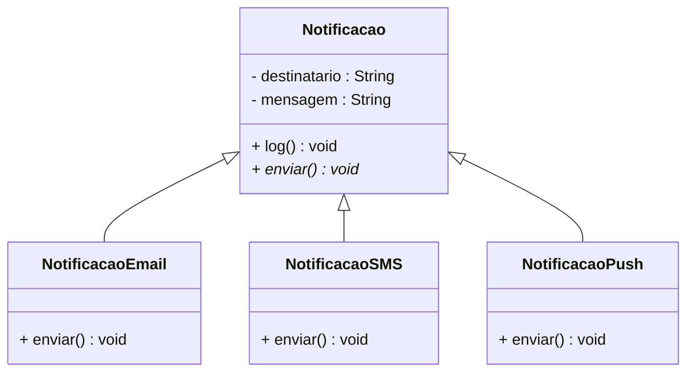

<h1>Classes Abstratas</h1>


Vamos começar relembrando os fundamentos da Orientação a Objetos...

- Um programa orientado a objetos é construído para representar **elementos do mundo real**.
- Esses elementos são representados por **objetos**, que modelam partes do problema que estamos tentando resolver.
- Os objetos são criados com base em **classes**, que definem de forma **abstrata** como esses objetos devem ser.

> **Abstrato**: aquilo que é genérico, não concreto. Refere-se a conceitos mais amplos, que ainda não possuem forma ou comportamento totalmente definidos.

No nosso **Projeto Guia (Conta Bancária)**, a classe `Conta` representa essa ideia abstrata, ou seja, um modelo genérico de conta bancária. Quando falamos sobre “uma conta”, estamos nos referindo a uma definição **genérica**, que descreve apenas o que **todas as contas bancárias têm em comum**, como número da conta, saldo e titular — sem especificar regras ou comportamentos particulares.

Já as classes `ContaCorrente` e `ContaPoupanca` representam **tipos específicos de conta**, cada uma com seus próprios detalhes e regras de funcionamento.

> **Especificidades:** no nosso exemplo, são os comportamentos e atributos exclusivos de cada tipo de conta.

Na prática, **não faz sentido instanciar diretamente uma `Conta` genérica**, porque ela é apenas um modelo base. Toda conta precisa ser de um tipo específico — como uma conta corrente ou poupança.

Por isso, usamos o conceito de **classe abstrata**, que permite representar esse modelo genérico **sem permitir a sua instanciação direta**.

<br />

<h3>1.1. O que é uma Classe Abstrata?</h3>


Uma **classe abstrata** é uma classe que:

- **Não pode ser instanciada diretamente**;
- **Pode conter métodos concretos (com implementação)**;
- **Pode conter métodos abstratos (sem implementação)**;
- **Serve como base para outras classes**, que herdarão suas propriedades e comportamentos comuns.

Para declarar uma classe abstrata em Java, usamos o modificador `abstract`:

> **Classe concreta** é uma classe que pode ser instanciada normalmente.

**Sintaxe:**

```java
public abstract class NomeDaClasse{
    // Corpo da classe
}
```

<br />

<h3>1.2. Por que utilizar Classes Abstratas?</h3>


Classes abstratas são úteis quando:

- Precisamos de uma **estrutura comum** para várias classes que compartilham características;
- Queremos **padronizar comportamentos**, mas deixar a implementação para as subclasses;
- Desejamos **evitar instanciar diretamente** um tipo genérico.

Em hierarquias de herança, as classes mais **genéricas** e **abstratas** ficam no topo, enquanto as classes mais **específicas** ficam na base, herdando comportamentos e implementando os detalhes:

<br />

<h3>1.3. Métodos Abstratos</h3>


Um **método abstrato** é um método **sem implementação** — ou seja, **sem corpo**. Ele apenas define a assinatura, indicando que **deve ser implementado** por qualquer subclasse concreta.

Características:

- Declarado com o modificador `abstract`;
- Termina com ponto e vírgula `;`;
- **Só pode existir dentro de uma classe abstrata**;
- Subclasses concretas são obrigadas a implementar esse método.

<br />

**Sintaxe - Método Abstrato dentro da Classe Abstrata**

```java
public abstract class SuperClasse{
    // Corpo da classe
    
    public abstract void metodoAbstrato();
}
```

**Sintaxe - Subclasse (Classe estendida ou herdada)**

```java
public class SubClasse extends SuperClasse {
    // Corpo da classe
    
    @Override
    public void metodoAbstrato() {
        // Corpo do método
    }
}

```

<br />

## Exemplo 01 - Classes e Métodos Abstratos


Imagine um sistema que envia notificações para usuários por diferentes canais: **e-mail**, **SMS** ou **push notification**.

> Uma **push notification** (ou **notificação push**) é uma **mensagem enviada diretamente de um servidor para o dispositivo do usuário**, mesmo que o aplicativo ou site não esteja aberto no momento.
>
> **Exemplos do dia a dia:**
>
> - Um e-commerce notifica que seu pedido foi enviado.
> - Um app de delivery informa que o entregador está a caminho.

Queremos definir um modelo comum para qualquer tipo de notificação, mas cada canal tem regras próprias de envio. Nesse caso, criamos uma **classe abstrata `Notificacao`**, que define o método abstrato `enviar()`.

<br />

### **Diagrama de classes**



<br />

**Classe Abstrata - Notificacao**

```java
package classe_abstrata;

public abstract class Notificacao {
	
	protected String destinatario;
	protected String mensagem;

	public Notificacao(String destinatario, String mensagem) {
		this.destinatario = destinatario;
		this.mensagem = mensagem;
	}

	public String getDestinatario() {
		return destinatario;
	}

	public void setDestinatario(String destinatario) {
		this.destinatario = destinatario;
	}

	public String getMensagem() {
		return mensagem;
	}

	public void setMensagem(String mensagem) {
		this.mensagem = mensagem;
	}

	// Método comum a todos os tipos
	public void log() {
		System.out.println("Notificação registrada para: " + destinatario);
	}

	// Método abstrato que será implementado nas subclasses
	public abstract void enviar();
	
}
```

<br />

**Classe Concreta - Email**

```java
package classe_abstrata;

public class Email extends Notificacao {

    public Email(String destinatario, String mensagem) {
        super(destinatario, mensagem);
    }

    @Override
    public void enviar() {
        System.out.println("Enviando e-mail para " + destinatario + ": " + mensagem);
    }
}

```

<br />

**Classe Concreta - SMS**

```java
package classe_abstrata;

public class SMS extends Notificacao {

    public SMS(String destinatario, String mensagem) {
        super(destinatario, mensagem);
    }

    @Override
    public void enviar() {
        System.out.println("Enviando SMS para " + destinatario + ": " + mensagem);
    }
}

```

<br />

**Classe Concreta - Push**

```java
package classe_abstrata;

public class Push extends Notificacao {

    public Push(String destinatario, String mensagem) {
        super(destinatario, mensagem);
    }

    @Override
    public void enviar() {
        System.out.println("Enviando push notification para " + destinatario + ": " + mensagem);
    }
}

```

<br />

**Classe Concreta - TestaNotificacao**

```java
package classe_abstrata;

public class TestaNotificacao {
    
    public static void main(String[] args) {
        
        Email email = new Email("usuario@email.com", "Seu pedido foi confirmado!");
        SMS sms = new SMS("+5511999999999", "Código de verificação: 123456");
        Push push = new Push("usuário123", "Você tem uma nova mensagem.");

        email.enviar();
        email.log();

        sms.enviar();
        sms.log();

        push.enviar();
        push.log();
    }
}

```

**Resultado do Algoritmo:**

```bash
Enviando e-mail para usuario@email.com: Seu pedido foi confirmado!
Notificação registrada para: usuario@email.com

Enviando SMS para +5511999999999: Código de verificação: 123456
Notificação registrada para: +5511999999999

Enviando push notification para usuário123: Você tem uma nova mensagem.
Notificação registrada para: usuário123
```

Este exemplo ilustra de forma clara como utilizar uma **classe abstrata** para definir uma estrutura comum em um sistema de notificações. 

A classe `Notificacao` serve como modelo base, contendo os atributos compartilhados (`destinatario` e `mensagem`) e um método abstrato chamado `enviar()`, que deve ser implementado de maneira específica por cada canal de envio. Além disso, possui o método `log()`, que é concreto e pode ser reaproveitado por todas as subclasses, garantindo padronização no registro de notificações.

As subclasses `Email`, `SMS` e `Push` herdam da classe abstrata e fornecem suas próprias implementações para o método `enviar()`, conforme as particularidades de cada meio de comunicação. Essa abordagem favorece o **reuso de código**, facilita a **manutenção** do sistema e promove uma **arquitetura mais organizada**, alinhada com os princípios da programação orientada a objetos.

Esse tipo de estrutura é comum em aplicações reais, como sistemas que enviam alertas de segurança, mensagens de recuperação de senha, confirmações de pedido ou notificações de promoções. Ao aplicar herança e abstração corretamente, é possível construir soluções flexíveis e escaláveis para diferentes tipos de comunicação.

<br />

------

## 🔑**Pontos chave:**

1. **Classes Abstratas** são classes que **não podem ser instanciadas diretamente**, servindo como base para a derivação de outras classes. Representam conceitos genéricos e centralizam atributos e comportamentos comuns.
2. Declaramos uma classe como abstrata utilizando o modificador **abstract** na sua assinatura.
3. **Abstract** é um **modificador non-access** (não relacionado a controle de acesso), aplicável a **Classes, Métodos e Interfaces** em Java.
4. Uma Classe Abstrata é considerada **incompleta**, pois depende de subclasses concretas para implementar seus métodos abstratos. Portanto, **a existência de subclasses é obrigatória**.
5. **Métodos Abstratos** são métodos sem corpo, declarados com o modificador **abstract**, terminando com ponto e vírgula (`;`). Eles **devem ser implementados nas subclasses concretas**.
6. **Métodos Abstratos** só podem existir em **Classes Abstratas**.
7. Uma **subclasse concreta (não abstrata)** que herda métodos abstratos **é obrigada a implementar todos esses métodos**. Caso não implemente, deverá ser declarada como abstrata.
8. A utilização de **Classes Abstratas promove reutilização de código, padronização de comportamentos e favorece a construção de sistemas extensíveis e coesos**.

<br /><br />

<div align="left"><a href="README.md">Voltar</a></div>
