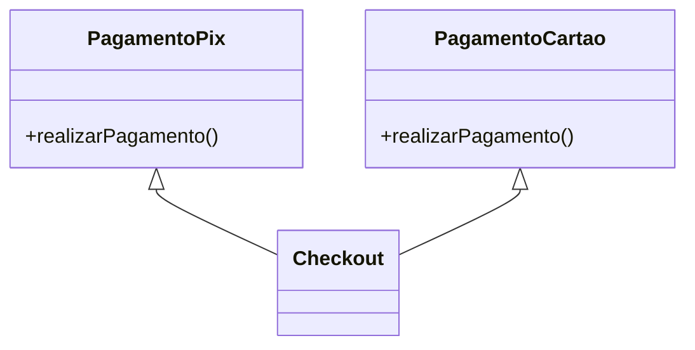
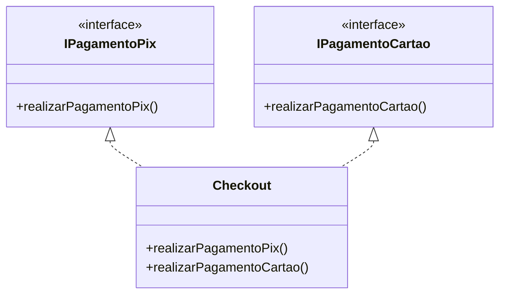
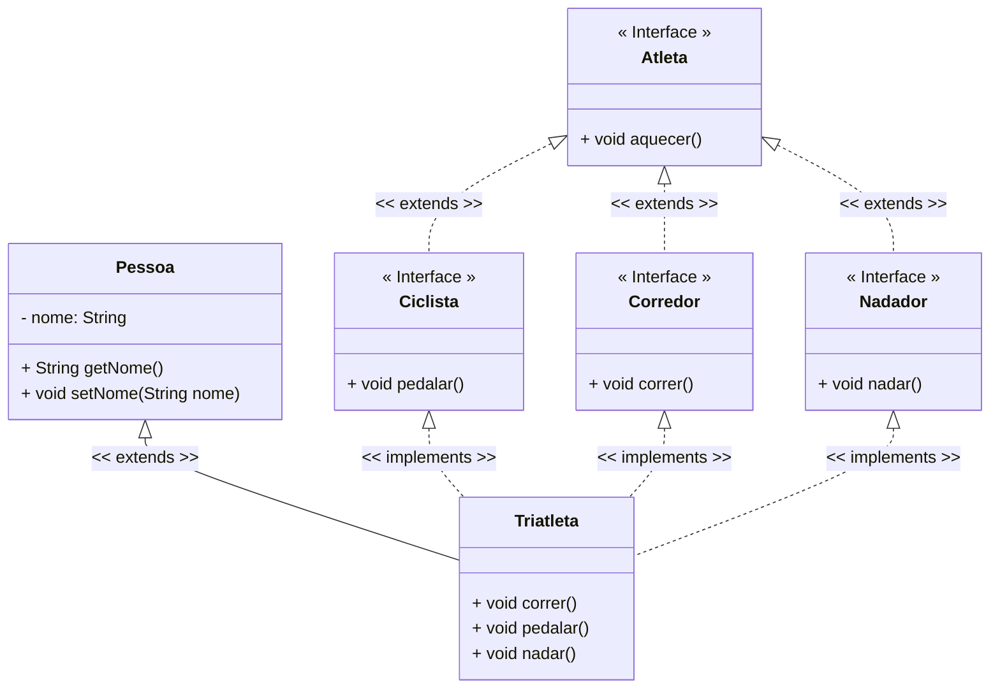

<h1>Interfaces</h1>


Como vimos anteriormente no conteúdo sobre **Herança**, a linguagem Java permite que uma classe herde os atributos e comportamentos de outra classe, chamada **superclasse**, com o objetivo de promover a **reutilização de código** e simplificar o processo de desenvolvimento. Essa herança é chamada de **herança simples** e está presente na maioria das linguagens orientadas a objetos.

Entretanto, Java **não permite herança múltipla de classes**, ou seja, **uma classe não pode estender mais de uma superclasse ao mesmo tempo**. Isso evita ambiguidades que poderiam surgir quando duas superclasses possuem métodos ou atributos com o mesmo nome. O exemplo abaixo, representado em diagrama de classes, **não é válido em Java**:



No Diagrama acima, a classe `Checkout` herda `PagamentoPix` e `PagamentoCartao` ao mesmo tempo, o que não é permitido em Java, pois **Java não suporta herança múltipla com classes concretas**.

> **Herança Simples**: permite que uma subclasse herde atributos e comportamentos de **uma única superclasse**.
>
> **Herança Múltipla**: permite que uma subclasse herde características de **duas ou mais superclasses**. Presente em linguagens como C++, mas **não suportada diretamente em Java**.

Para contornar a limitação da herança múltipla, o Java oferece uma solução elegante e robusta: o uso de **Interfaces**. 



No Diagrama acima, a classe `Checkout` agora implementa duas interfaces (`IPagamentoPix` e `IPagamentoCartao`). Isso é perfeitamente válido e comum em Java, pois **Java permite implementar múltiplas interfaces**.

<br />

<h3>1.1. O que são Interfaces?</h3>


**Interface** é uma estrutura que representa uma **classe abstrata "pura"** em Java. Diferente de uma classe comum, **não possui atributos de instância** (só permite constantes estáticas — ou seja, atributos `public static final`), **não possui construtor** e **todos os métodos declarados são, por padrão, abstratos e públicos**. Além disso, **uma interface não é declarada com a palavra-chave `class`, e sim com `interface`**.

> Em Java, além dos métodos abstratos, **as interfaces podem conter métodos `default` e `static` com implementação**.
>
> O **método `default`** permite definir uma implementação padrão que pode ser reutilizada ou sobrescrita pelas classes que implementam a interface. 
>
> Já os **métodos `static`** servem como utilitários da própria interface e são acessados diretamente pelo nome da interface, sem instância.
>
> Apesar dessas possibilidades, o uso mais comum das interfaces continua sendo a definição de **métodos abstratos**, que representam contratos a serem implementados pelas classes.

Em Java, **uma classe pode implementar múltiplas interfaces**, o que permite simular herança múltipla. No entanto, **não é recomendável implementar mais de três interfaces em uma única classe**, pois isso pode gerar um aumento desnecessário na complexidade e dificultar a manutenção do código.

A interface define **um conjunto de métodos apenas com a assinatura (sem corpo)**, que **devem ser obrigatoriamente implementados pelas classes que a utilizam**. 

**Sintaxe - Interface**

```java
public interface NomeDaInterface {
    // Assinaturas dos métodos
    public void metodo();
}
```

<br />

**Sintaxe - Implementação da Interface em uma Classe Concreta**

```java
public class ClasseConcreta implements NomeDaInterface{
    
    // Corpo da classe
    
    public void metodo(){
        // Implementação do método
    }
    
}
```

Observe a **sintaxe utilizada para implementar uma interface em uma classe Java**. Repare que, diferentemente da herança com classes (que utiliza `extends`), a implementação de uma interface é feita com a palavra-chave **`implements`** na assinatura da classe.

Ao implementar uma interface, a classe se compromete a fornecer a implementação de **todos os métodos definidos na interface**, garantindo que o contrato estabelecido seja respeitado. Esse mecanismo promove a padronização de comportamentos entre diferentes classes, mesmo que não tenham relação direta na hierarquia de herança.

<br />

## Exemplo 01 - Interface


No **Java, uma classe só pode herdar uma única superclasse**, o que significa que **herança múltipla de classes não é permitida**. Essa limitação existe para evitar conflitos de ambiguidade e garantir a simplicidade na hierarquia de classes. Para contornar esse cenário e ainda permitir que uma classe tenha comportamentos de múltiplas origens, utilizamos o conceito de **interfaces**.

Vamos ilustrar esse conceito com um exemplo prático:

<div align="center"></div>

Na imagem acima, vemos que as classes **Corredor**, **Nadador** e **Ciclista** estendem (herdam) a classe base **Atleta**. Agora, suponha que desejamos criar uma nova classe chamada **Triatleta**, que representa um atleta que corre, nada e pedala.

Inicialmente, poderíamos imaginar algo assim:

<div align="center"></div>

Na imagem acima, a classe **Triatleta** tenta herdar diretamente as três classes: **Corredor**, **Nadador** e **Ciclista**. Teoricamente, isso permitiria que Triatleta tivesse os comportamentos de todas essas classes.

**Porém, na prática, isso não funciona em Java**, pois **não é permitido herdar de múltiplas classes diretamente**.

Para resolver esse problema, utilizamos **interfaces**. Nesse novo cenário, **Corredor**, **Nadador** e **Ciclista** são definidas como interfaces, cada uma declarando os métodos que representam seus respectivos comportamentos.

A classe **Triatleta** então **implementa** essas interfaces, adquirindo os comportamentos desejados sem violar a regra da herança múltipla, como vemos na imagem abaixo:

<div align="center"></div>

Abaixo, temos o **Diagrama de Classes** representando essa nova estrutura, onde as responsabilidades estão corretamente separadas entre **interfaces e classes concretas**, respeitando as regras do Java e promovendo um design mais flexível e modular.

<br />

**Exemplo 01 - Diagrama de Classes** 



Observe no Diagrama de Classes acima, quando uma interface herda outra, o relacionamento entre interfaces foi representado com uma seta **pontilhada**, acompanhada do rótulo `<<extends>>`, indicando que uma interface está especializando outra. Essa convenção é essencial para diferenciar a herança entre interfaces da herança entre classes concretas.

Da mesma forma, ao indicar que uma classe concreta implementa interfaces, também se deve utilizar a seta **pontilhada**, com o rótulo `<<implements>>`. Essa notação reforça visualmente que a classe adquire os comportamentos definidos pelas interfaces, sem estabelecer herança de atributos ou implementação direta. 

<br />

**Classe Pessoa**

```java
package interfaces;

public abstract class Pessoa {

    private String nome;

    public Pessoa(String nome) {
        this.nome = nome;
    }

    public String getNome() {
        return nome;
    }

    public void setNome(String nome) {
        this.nome = nome;
    }
    
    public void cansou() {
        System.out.println("\nCansou...");
    }
}
```

A classe `Pessoa` representa a superclasse da hierarquia. Ela foi definida como uma classe abstrata, com um único atributo privado `nome`, além do respectivo construtor e os métodos de acesso `get` e `set`. Também foi incluído o método `cansou()`, que simula uma ação comum a qualquer pessoa após realizar esforço físico, conforme representado no Diagrama de Classes apresentado anteriormente.

<br />

**Interface Atleta**


```java
package interfaces;

public interface Atleta {

    public void aquecer();
    
}
```

A interface `Atleta` define um comportamento genérico e obrigatório para qualquer tipo de atleta: o método `aquecer()`. Ela serve como base para as demais interfaces que especializam os tipos de atletas.

<br />

**Interface Ciclista**


```java
package interfaces;

public interface Ciclista extends Atleta {

    public void pedalar();
}
```

<br />

**Interface Corredor**


```java
package interfaces;

public interface Corredor extends Atleta {

    public void correr();
}
```

<br />

**Interface Nadador**


```java
package interfaces;

public interface Nadador extends Atleta{

    public void nadar();
}
```

As interfaces `Ciclista`, `Corredor` e `Nadador` estendem a interface `Atleta`, especializando-a com métodos adicionais: `pedalar()`, `correr()` e `nadar()`, respectivamente. Cada uma representa uma habilidade específica de um atleta, mantendo o princípio da separação de responsabilidades.

> [!IMPORTANT]
>
> Interfaces podem herdar outras interfaces utilizando a palavra-chave `extends`. Entretanto, uma classe concreta, ao implementar uma interface, precisa garantir que todos os métodos herdados e declarados sejam implementados.

<br />

**Classe Triatleta**


```java
package interfaces;

public class Triatleta extends Pessoa implements Nadador, Corredor, Ciclista{

    public Triatleta(String nome) {
        super(nome);
        
    }

    @Override
    public void aquecer() {
        System.out.println("\nAquecendo...");
        
    }

    @Override
    public void pedalar() {
        System.out.println("\nPedalando...");
        
    }

    @Override
    public void correr() {
        System.out.println("\nCorrendo...");
        
    }

    @Override
    public void nadar() {
        System.out.println("\nNadando...");
        
    }

}
```

A classe `Triatleta` estende a classe `Pessoa` e implementa as interfaces `Nadador`, `Corredor` e `Ciclista`, consolidando os comportamentos definidos por cada uma delas. Todos os métodos das interfaces foram devidamente implementados, respeitando o "contrato" estabelecido pelas interfaces. Isso demonstra como o Java permite a reutilização de comportamentos múltiplos por meio de **implementação de interfaces**, mesmo sem suportar herança múltipla de classes.

<br />

**Classe TestaTriatleta**

```java
package interfaces;

public class TestaTriatleta {

    public static void main(String[] args) {

        Triatleta triatleta = new Triatleta("Kelvyn");
        
        triatleta.aquecer();
        triatleta.nadar();
        triatleta.pedalar();
        triatleta.correr();
        triatleta.cansou();

    }

}
```

Na classe `TestaTriatleta`, é instanciado um objeto da classe `Triatleta`. Graças à herança da classe `Pessoa` e à implementação das interfaces, o objeto `triatleta` possui acesso a todos os métodos definidos nas interfaces (`aquecer()`, `nadar()`, `pedalar()`, `correr()`) e ao método `cansou()` herdado da superclasse. Esse exemplo demonstra a aplicação prática dos conceitos de herança e interfaces no Java de forma clara e funcional.

**Resultado do Algoritmo:**

```
Aquecendo...

Nadando...

Pedalando...

Correndo...

Cansou...
```

<br />

<h2>2. Interfaces vs Classes Abstratas</h2>


A tabela abaixo apresenta as principais diferenças entre **classes abstratas** e **interfaces** em Java, destacando suas finalidades, restrições e formas de uso:

| **Classes Abstratas**                                        | **Interfaces**                                               |
| ------------------------------------------------------------ | ------------------------------------------------------------ |
| Agrupam classes com **comportamentos compartilhados**        | Agrupam classes com **comportamentos distintos**             |
| Permitem herança **simples**, compartilhando código comum (`extends`) | Permitem herança **múltipla**, compartilhando apenas **assinaturas** de métodos (`implements`) |
| Uma classe só pode estender **uma única classe abstrata**    | Uma classe pode implementar **várias interfaces** simultaneamente |
| Podem conter atributos de instância                          | Não possuem atributos de instância (apenas constantes)       |
| Podem ter métodos com ou sem corpo                           | Antes do Java 8, apenas métodos abstratos; após Java 8, podem ter métodos `default` e `static` com corpo |

<br />

<h2>3. Regras para usar Interface</h2>


Abaixo estão listadas as principais regras que devem ser observadas ao declarar e utilizar interfaces em Java. Essas diretrizes são fundamentais para garantir o uso correto do recurso, de acordo com a especificação da linguagem:

1. **Interfaces não podem ser instanciadas** diretamente como classes concretas.
2. **Interfaces não podem ser declaradas como `final`**, pois devem estar disponíveis para implementação por outras classes.
3. **Interfaces não possuem atributos de instância**, apenas **constantes (`static final`)**, que são públicas por padrão.
4. **Uma classe que implementa uma interface deve obrigatoriamente fornecer implementações para todos os métodos declarados** na interface, a menos que seja uma classe abstrata.
5. **A visibilidade dos métodos da interface deve ser mantida como `public`** ao serem implementados. Não é permitido reduzir essa visibilidade.
6. **Um método de interface pode ser implementado com um corpo vazio** na classe, desde que a assinatura seja respeitada. Isso pode ser útil em implementações parciais ou temporárias.
7. **Interfaces de nível superior podem ser declaradas como `public` ou com acesso padrão (package-private)**, dependendo da visibilidade desejada.
8. **Todos os métodos em interfaces são implicitamente `public` e `abstract`**, mesmo que essas palavras-chave não sejam explicitamente utilizadas.
9. **Ao adicionar um novo método a uma interface**, todas as classes concretas que a implementam devem fornecer uma nova implementação para esse método, uma vez que todos os métodos são obrigatórios.

Interfaces são fundamentais para criar aplicações flexíveis, promovendo um baixo acoplamento entre as classes (classes com poucas dependências diretas).

<br />

------

## 🔑**Pontos chave:**

1. **Interface** é uma estrutura em Java que define um **contrato de métodos (assinaturas)** sem implementação. É considerada uma forma de **classe abstrata “pura”**, pois **não possui atributos de instância (apenas constantes estáticas)**, **não possui construtor** e **é declarada com a palavra-chave `interface`**.
2. Uma classe pode **implementar múltiplas interfaces**, permitindo simular herança múltipla de comportamentos. No entanto, embora seja tecnicamente possível, **não é recomendável implementar mais de três interfaces em uma mesma classe**, para manter a simplicidade e a legibilidade do código.
3. Interfaces definem **métodos abstratos (sem corpo)**, que devem ser **obrigatoriamente implementados** por qualquer classe concreta que as utilize. A partir do **Java 8**, interfaces também podem conter métodos `default` e `static` com implementação.

<br /><br />

<div align="left"><a href="README.md">Voltar</a></div>